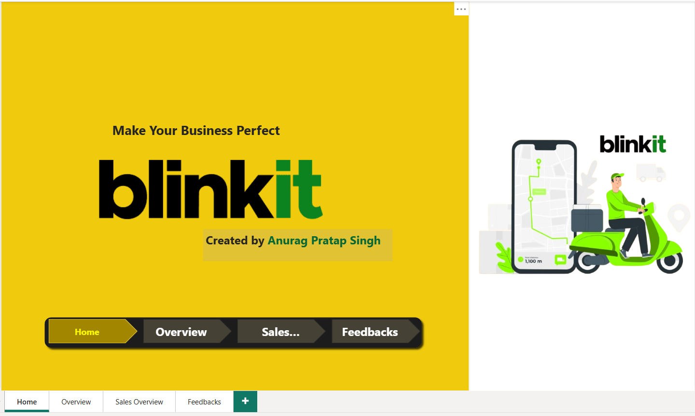
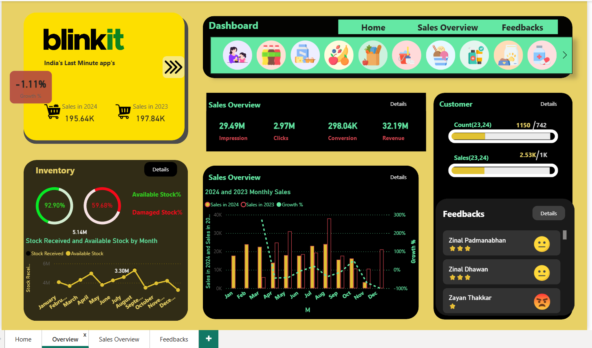
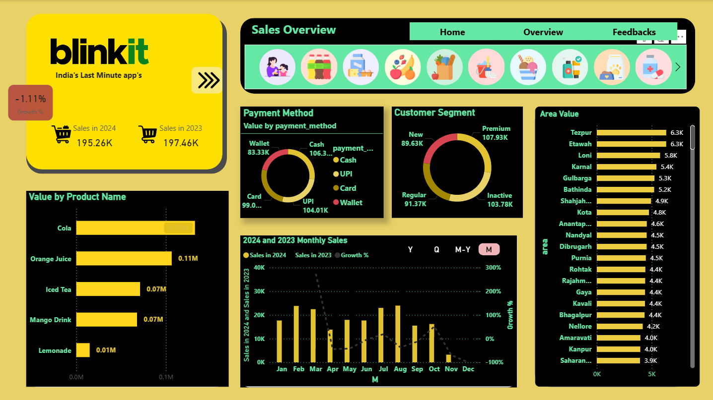
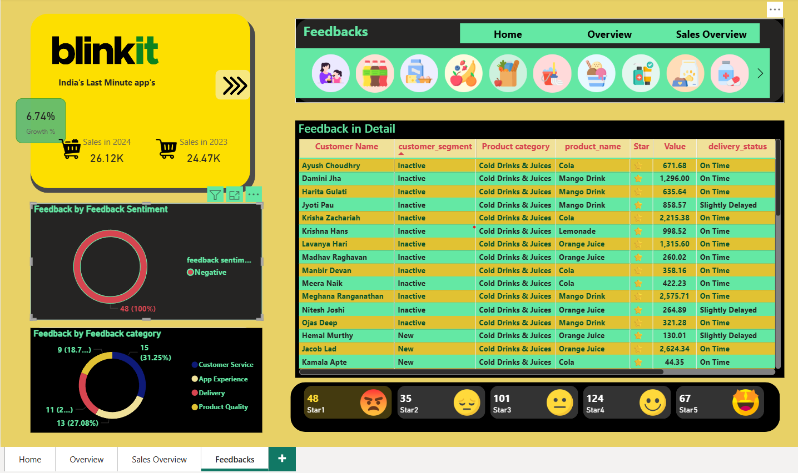

# 🛒 Blinkit Sales Dashboard (Power BI)

> 🚀 A clean Power BI dashboard project designed to analyze Blinkit's sales performance, customer feedback, and regional trends.

---

## 📊 Project Overview

This project replicates a real-world scenario for an e-commerce platform. It focuses on:

- Monthly revenue and order trends
- Category and city-wise breakdown
- Customer feedback insights
- Dynamic slicers and filters
- KPI cards for top metrics

---

## 🎯 Objective

Enable leadership at Blinkit to understand sales performance, identify top/bottom categories, and make better decisions using data visuals.

---

## 🛠️ Tools Used

| Tool       | Purpose                         |
|------------|----------------------------------|
| Power BI   | Dashboard creation, DAX, visuals |
| Excel      | Data cleanup & transformation    |
| DAX        | Measures, KPIs, logic             |
| Slicers    | Interactive filtering             |

---

## 📸 Dashboard Preview

## 📊 Dashboards – Power BI Visuals

### 🔸 1. Sales Overview Dashboard  
A high-level summary of Blinkit's sales metrics and performance indicators.

---

### 🔸 2. Category-wise Analysis  
Breakdown of sales, revenue, and orders by product category.

---

### 🔸 3. Time Series Trends  
Visualization of order volume and revenue over time (daily, weekly, or monthly).

---

### 🔸 4. Geographical Performance  
Region- or city-level analysis of sales and user behavior.

## ✅ Key Features

- Multi-page report (Overview, Sales, Feedback)
- Real-time slicers
- Drill-through capability
- Modern UI with category-wise filters
- KPI cards with icons and visuals

---

## 📁 Files Included

- `Blinkit_Sales_Report.pbix` – Main dashboard file
- `Images/dashboard_preview.png` – Dashboard preview
- `Data/sample_dataset.csv` – Sample data (optional)

---

## 👨‍💻 Created By

**Anurag Pratap Singh**  
📧 anuragiaf1234@gmail.com  
🔗 [LinkedIn](https://linkedin.com/in/anuragaiaf) • [GitHub](https://github.com/Anuraga123)

---
